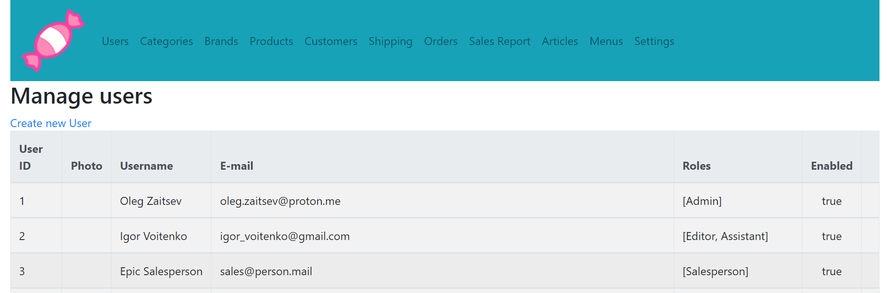

# Online-Shop
Spring Boot shop web application
## Description
**This project is currently in development! New features are pushed regularly.**

This is a E-commerce Shop developed in Java language using Spring Boot and other tools, such as Maven, PostgreSQL, Hibernate.
Basically, it consists of two parts:
BackEnd part, which is responsible for handling admin management,
and FrontEnd part, which is responsible for customer shopping, product reviews, etc.

    
    "Users" page view
